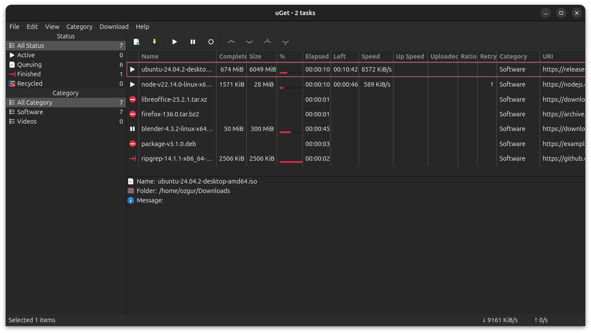

#  uGet Download Manager

A lightweight, full-featured download manager for Linux and Windows. Built with GTK4 and libcurl.

[](COPYING)


---



## Features

- **Multi-connection downloading** — split files across multiple connections for faster speeds
- **Queue management** — organize downloads into categories with per-category limits
- **Pause, resume, and schedule** — full control over when and how downloads run
- **aria2 integration** — BitTorrent, metalink, and advanced protocol support via aria2 plugin
- **System tray** — StatusNotifierItem integration for background operation
- **Clipboard monitoring** — automatically detect downloadable links
- **36 languages** — broad internationalization support
- **Desktop notifications** — with optional notification sounds via GStreamer

## Building from Source

```bash
meson setup build
ninja -C build
meson test -C build       # run tests
ninja -C build install    # install
```

See [BUILDING.md](BUILDING.md) for dependencies, distro-specific instructions, and build options.

## History

Originally created by [C.H. Huang](https://sourceforge.net/projects/urlget/) and maintained from 2005 to 2020. This fork revives the project with a complete GTK4 migration, modern Meson build system, and ongoing maintenance.

See [CHANGELOG.md](CHANGELOG.md) for the full version history.

## License

LGPL-2.1-or-later with OpenSSL exception. See [COPYING](COPYING) for details.
